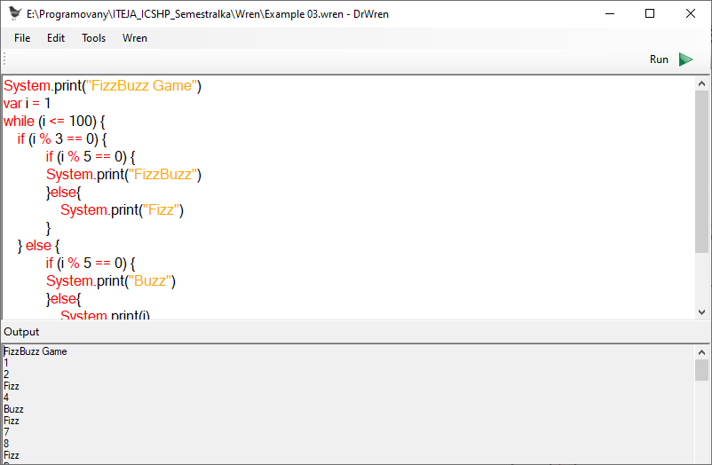
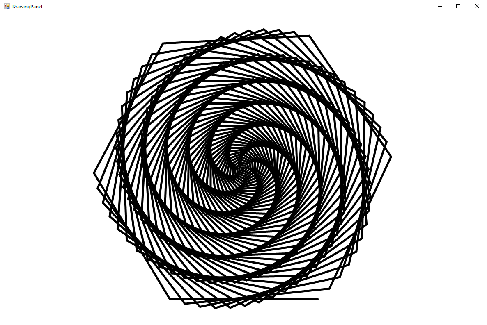

# Simple Wren interpreter with editor.

This project is school project for Language theory and The C# Programming Language classes. The main goal of this project is too create simplified Wren interpreter with Turtle graphics. 

## Technologies

- C#

- .Net Framework

- Winforms

## The project contains:

- Simplified interpreter for [Wren language](https://wren.io/)

- Wren editor with name DrWren inspired by [DrRacket](https://racket-lang.org/).

- Turtle graphics.

## Screenshots:

